# Curve-Text-Rectification-Using-Pairs-Of-Points

This repository  is designed via traditional image processing, not deep learning. 

It's a way to rectify curve text images using spatial transformer by pairs of points. This could be rectify the curve text image after text detection, and helps text recognition easily in OCR tasks. 

This method is based on calibration technology of monocular vision. It depends on pairs of points by detector just like [CRAFT](https://arxiv.org/abs/1904.01941).

## Requirements

- numpy
- opencv-python

## Usage

```
python3 test.py --image image_path --txt points_txt_path_corresponding_to_image --mode calibration
```

```
python3 test.py --image ./data/test_images/gt_86.jpg --txt ./data/test_txt/gt_86.txt --mode calibration
```

or

```
python3 curve_text_rectification.py --mode homography
```

Results will saved in `results` directory.

| mode          | description                                                  |
| ------------- | ------------------------------------------------------------ |
| `calibration` | Monocular Vision: 3-D model and fish-eye camera  undistortion. |
| `homography`  | Homography matrix by every 4-points-image. Higher FPS and lower precision |

## Interface

```
from curve_text_rectification import AutoRectifier
autoRectifier = AutoRectifier()

"""
run for texts in an image
:param image_data: numpy.ndarray. The shape is [h, w, 3]
:param points_list: [[x1,y1,x2,y2,x3,y3,...], [x1,y1,x2,y2,x3,y3,...], ...], clockwise order, (x1,y1) must be the top-left of first char.
:param interpolation: cv2.INTER_NEAREST, cv2.INTER_LINEAR, cv2.INTER_AREA, cv2.INTER_CUBIC, cv2.INTER_LANCZOS4
:param ratio_width:  roi_image width expansion. It should not be smaller than 1.0
:param ratio_height: roi_image height expansion. It should not be smaller than 1.0
:param loss_thresh: if loss greater than loss_thresh --> get_rotate_crop_image
:param mode: 'calibration' or 'homography'. when homography, ratio_width and ratio_height must be 1.0
:return: res: roi-image list, visualized_image: draw polys in original image
"""
res, visualized_image = autoRectifier.run(image_data, points_list, interpolation=cv2.INTER_LINEAR, ratio_width=1.0, ratio_height=1.0, loss_thresh=5.0, mode='calibration')
```

## Demo

### 1


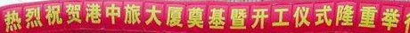

### 2


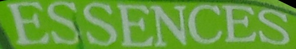

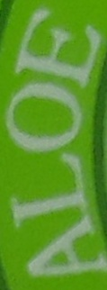

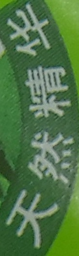

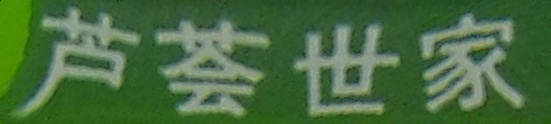

### 3


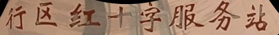

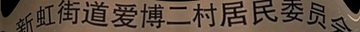

### 4


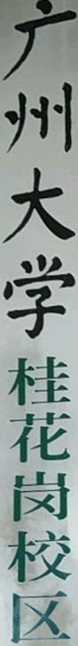

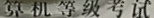

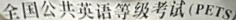

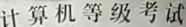

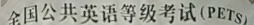

### 5

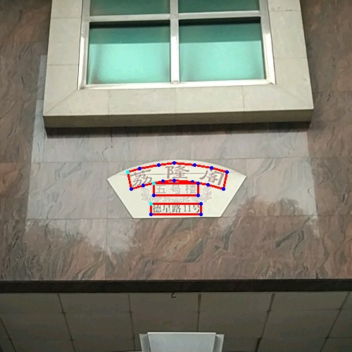

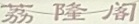

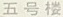

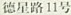

### calibration failure

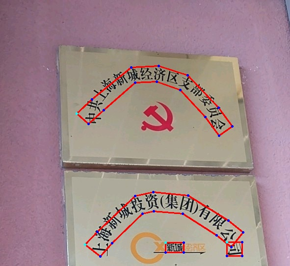

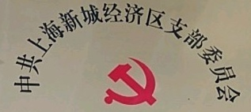

#### homography

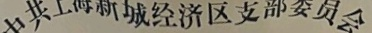

## Reference

- [Camera Calibration and 3D Reconstruction](https://docs.opencv.org/3.4.12/d9/d0c/group__calib3d.html)
- [Character Region Awareness for Text Detection](https://arxiv.org/abs/1904.01941)
- [CRAFT-pytorch](https://github.com/clovaai/CRAFT-pytorch)
- [A Flexible New Technique for Camera Calibration](https://www.microsoft.com/en-us/research/wp-content/uploads/2016/02/tr98-71.pdf)
- [Monocular_vision](https://en.wikipedia.org/wiki/Monocular_vision)
- [deep-text-recognition-benchmark](https://arxiv.org/abs/1904.01906)
- [https://rrc.cvc.uab.es/](https://rrc.cvc.uab.es/)
- [Geometric Image Transformations](https://docs.opencv.org/master/da/d54/group__imgproc__transform.html)